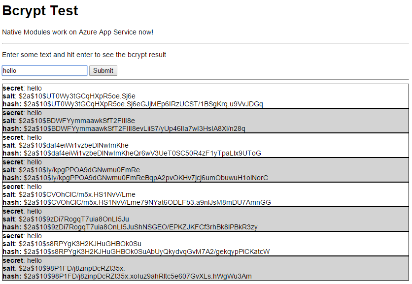

# Testing a node native module on Azure App Service

We recently added native module support in Azure App Service. This sample is designed to make it easy to deploy a sample that works.

We recommend using node version v4.2.1 and npm v3.3.9 when using native modules, but it's supported down to node v0.12.x. The package.json for this project has the recommend values set in the engines properties.

File issues in this repo if you have questions or ask on [Stack Overflow](http://stackoverflow.com/questions/tagged/azure-web-sites).

## Deploy

Press this button below to deploy this sample into an Azure Web App.

Optionally, you can deploy this sample yourself into an App you've already provisioned by cloning this repository and deploying via git yourself.

You can customize deployment via the deploy.cmd file. I've customized this script to do bower installation after install.

## API

### `/`

Returns the home page

Parameters: None

Returns:
 - 200 response: html home page

### `/api/hash?secret=<string>`

Returns the salt and hash of a given secret

Parameters:
 - secret : string

Returns:

- 200 response:

		{
		  salt: <string>,
		  hash: <string>
		}
- 500 response: generic server error
	- This occurs if you don't provide a secret parameter

## License

[MIT](./LICENSE)
